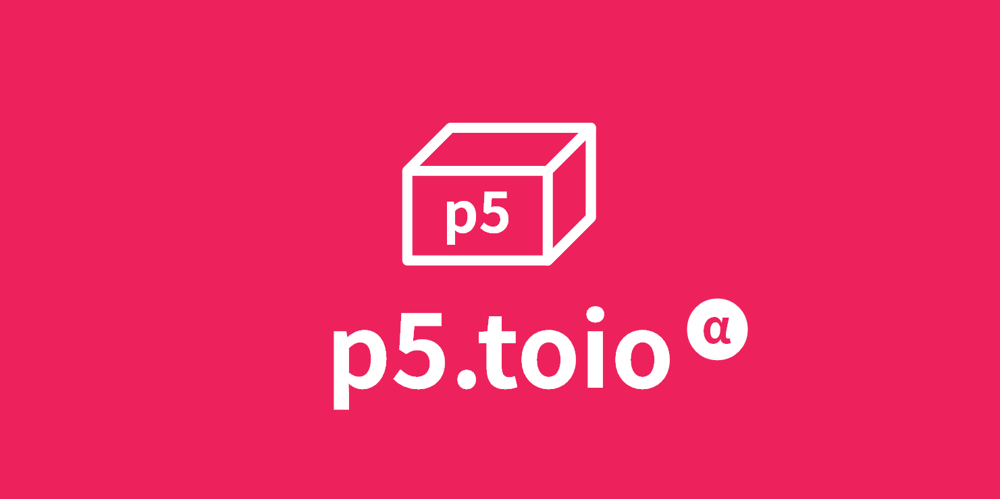

# p5.toio
Version 0.5.0  


# Description
p5.toio is a library for controlling toio™ in p5.js environment.  
A lot of APIs on toio™ can be used with just a simple step as below.  
Now we released an alpha-release(0.5.0) so that there is no test code, detailed API document or samples yet.  
Please wait for the next beta-release(0.8.0).

# Usage
## Import library
Just insert a sigle script after 2 dependent scripts `p5.js` and `p5.sound.min.js` in your `<head>`.  
```html 
    <script src="https://cdnjs.cloudflare.com/ajax/libs/p5.js/1.0.0/p5.js"></script>
    <script src="https://cdnjs.cloudflare.com/ajax/libs/p5.js/1.0.0/addons/p5.sound.min.js"></script>

    <!-- INSERT HERE -->
    <script src="https://tetunori.github.io/p5.toio/dist/0.5.0/p5.toio.min.js"></script>
```
We can also use the non-uglified code.  
```html
    <script src="https://tetunori.github.io/p5.toio/dist/0.5.0/p5.toio.js"></script>
```

## Use in your Sketch
### Search and Connect to toio™Core Cube
Call `P5tCube.connectNewP5tCube()` and receive `P5tCube` instance in Promise as below.  
This library depends on WebBluetooth so that this API must be called in a user-action function like `mouseClicked()` or `keyPressed()` etc.  


```javascript
const gCubes = [];

function mouseClicked() {
  P5tCube.connectNewP5tCube().then( cube => {
    // 'cube' is an instance of connected toio™Core Cube.
    gCubes.push( cube );

    // You can call any 
  } );
}
```

### Issue some APIs

### 

# Licence
This software is released under MIT License, see LICENSE.

# Author
Tetsunori NAKAYAMA.

# References
## TypeScript
[p5-typescript-starter](https://github.com/Gaweph/p5-typescript-starter) [Gaweph](https://github.com/Gaweph)  
MIT License, Copyright (c) 2019 Gareth Williams
 
[O'Reilly "Programming TypeScript"](https://www.oreilly.com/library/view/programming-typescript/9781492037644/)  
[O'Reilly Japan - プログラミングTypeScript](https://www.oreilly.co.jp/books/9784873119045/)

## toio
